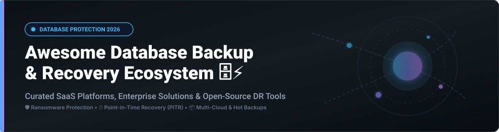
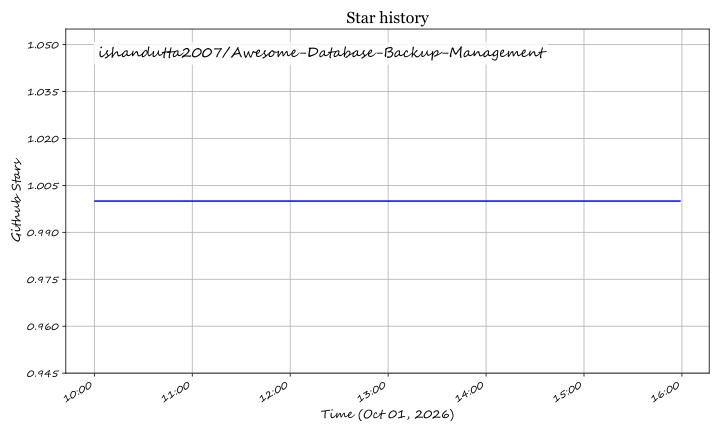

# Awesome Database Backup & Recovery Management Ecosystem 🗄️⚡

  
  
  
  

## 🚀 Overview & Ecosystem Architecture

Welcome to the definitive **Database Backup Management & Cyber Resilience Ecosystem**. This curated list tracks top **SaaS platforms**, enterprise data protection solutions, and production-grade **open-source GitHub projects** designed for DBAs, SREs, DevOps engineers, and Data Protection Officers. 

Whether you need **Point-in-Time Recovery (PITR)**, zero-downtime hot backups, immutable air-gapped ransomware vaulting, or multi-cloud database disaster recovery across PostgreSQL, MySQL, MongoDB, Oracle, and SQL Server, this repository serves as your ultimate technical reference guide.

---

## 📊 Market Size & Industry Dynamics

> [!NOTE]  
> **Market Size & Structure**: The global Data Backup & Disaster Recovery market is estimated at **$16.8 Billion (2026)** and is projected to reach over **$30 Billion by 2032** growing at a CAGR of ~11.5%. The Backup-as-a-Service (BaaS) sector alone is experiencing explosive growth (>25% CAGR) driven by ransomware threats and cloud adoption.  
> **Market Fragmentation**: The sector exhibits **moderate fragmentation with ongoing consolidation**. Market heavyweights (Rubrik, Veeam, Cohesity, Commvault) dominate enterprise cyber-resilience with large-scale acquisitions, while cloud-native and niche open-source tools thrive in specialized database-native environments.

---

## 🏢 SaaS & Commercial Enterprise Platforms

The table below outlines enterprise SaaS and commercial platforms, sorted by **Company Scale (ARR / Market Valuation)** in descending order.

| Platform | Description & Key Capabilities | Company Scale (Valuation / Revenue) | Starting Pricing (Specific Tier) | Free Forever Tier & Trial Limits |
| :--- | :--- | :--- | :--- | :--- |
| **[Rubrik](https://www.rubrik.com/)** 🛡️ | Cyber resilience & immutable backups with native PostgreSQL, Oracle, & MS SQL protection, zero-trust data security, and air-gapped retention. | **$23.0B Market Cap** ($1.57B Subscription ARR) | ~$2,736 / BETB / year (Enterprise Tier) | **No Free Forever Tier**; 30-day guided trial / POC upon sales request |
| **[Veeam](https://www.veeam.com/)** ⚡ | Enterprise backup & application-aware recovery for PostgreSQL, SQL Server, and cloud VM workloads with instant VM recovery. | **$15.0B Valuation** ($2.1B+ ARR) | ~$155 / workload / year (Veeam Universal License) | **Free Forever**: Community Edition up to 10 Workloads; 30-day full-featured trial |
| **[Cohesity](https://www.cohesity.com/)** 🔒 | Unified AI-powered data security and WORM storage vaulting for relational and distributed databases (MongoDB, Cassandra). | **$8.0B Valuation** ($1.6B+ Pro Forma Revenue) | ~$200 / TB / year (DataProtect SaaS starting) | **No Free Forever Tier**; 30-day SaaS evaluation trial |
| **[Commvault](https://www.commvault.com/)** 💾 | Enterprise Metallic cloud protection with IntelliSnap snapshot integration for Sybase, DB2, Oracle, and SQL Server. | **$6.2B Market Cap** ($1.18B Revenue) | ~$100 / workload / year (Metallic SaaS starting) | **No Free Forever Tier**; 30-day free trial on Metallic Cloud |
| **[Acronis](https://www.acronis.com/)** 🔐 | Integrated cyber protection combining image-based database backup, disaster recovery, and anti-ransomware AI defensive shields. | **$3.5B Valuation** (~$500M Revenue) | ~$69 / server / year (Cyber Protect Essentials) | **No Free Forever Tier**; 30-day full trial mode |
| **[Quest Rapid Recovery](https://www.quest.com/)** ⏱️ | Application-aware backup featuring automated nightly SQL attachability verification and instant VSS recovery. | **$3.0B Valuation** (~$850M Revenue) | ~$1,199 / core or socket | **No Free Forever Tier**; 14-day free trial download |
| **[Keepit](https://www.keepit.com/)** ☁️ | Vendor-neutral, independent SaaS backup platform with blockchain-like immutable storage and GDPR right-to-be-forgotten controls. | **$600M Valuation** ($100M+ ARR) | ~$3.50 / user / month | **No Free Forever Tier**; 30-day enterprise evaluation trial |
| **[HYCU](https://www.hycu.com/)** 🔀 | Multi-cloud native backup (R-Cloud) providing agentless SQL & database log replay across AWS, Google Cloud, and Azure. | **$300M Valuation** (~$50M Revenue) | ~$2.25 / user / month (SaaS) or custom VM packs | **No Free Forever Tier**; 14-day free trial on R-Cloud |
| **[NAKIVO Backup & Replication](https://www.nakivo.com/)** 📦 | Cost-effective backup and replication for Oracle RMAN, SQL Server, Microsoft 365, and VMware environments. | **$120M Valuation** (~$20M Revenue) | ~$229 / socket or $2.50 / workload / month | **Free Forever**: Free Edition for up to 10 VMs; 15-day trial |
| **[Percona Backup for MongoDB](https://www.percona.com/)** 🍃 | Enterprise-grade consistent cluster backup solution for MongoDB replica sets and sharded clusters with commercial support. | Enterprise Support ($1,500+/node/yr) | **100% Free Open-Source** / Commercial Support Available | **Free Forever**: Fully open-source under Apache 2.0 |

---

## 🛠️ Production Open-Source GitHub Repositories

Below is a curated collection of production-proven open-source tools for database backup, point-in-time recovery, and storage snapshotting. Sorted by **GitHub Stars_Count** (descending).

| Project & Repository | GitHub_Stars | Supported Databases | Key Features & Use Cases |
| :--- | :--- | :--- | :--- |
| **[restic/restic](https://github.com/restic/restic)** 🔒 |  | General File / Database Dumps | Secure, fast, deduplicated backup program with AES-256 encryption. Supports S3, SFTP, MinIO, and local targets. |
| **[duplicati/duplicati](https://github.com/duplicati/duplicati)** 🌐 |  | Database Dumps / Files | Free backup client for storing encrypted, incremental, compressed database dumps on cloud storage services. |
| **[borgbackup/borg](https://github.com/borgbackup/borg)** 📦 |  | General Database Dumps | Deduplicating backup program written in C/Python with authenticated encryption, compression, and remote repository support. |
| **[pgbackrest/pgbackrest](https://github.com/pgbackrest/pgbackrest)** 🐘 |  | PostgreSQL | Enterprise PostgreSQL backup framework supporting parallel streaming, differential/incremental backups, and S3 vaulting. |
| **[wal-g/wal-g](https://github.com/wal-g/wal-g)** ⚡ |  | PostgreSQL, MySQL, SQL Server, MongoDB | Archival and restoration tool for PostgreSQL/MySQL WAL streaming to cloud object storage with LZ4/ZSTD compression. |
| **[EnterpriseDB/barman](https://github.com/EnterpriseDB/barman)** 🍸 |  | PostgreSQL | Disaster recovery manager for PostgreSQL with point-in-time recovery (PITR), remote WAL streaming, and multi-server retention. |
| **[mydumper/mydumper](https://github.com/mydumper/mydumper)** 🐬 |  | MySQL, MariaDB | High-performance, multi-threaded logical backup and restore tool set for large MySQL databases (>1TB scale). |
| **[percona/percona-xtrabackup](https://github.com/percona/percona-xtrabackup)** 🏎️ |  | MySQL, Percona Server | Non-blocking hot backup utility for InnoDB and XtraDB storage engines with zero query downtime. |
| **[skyfay/dbackup](https://github.com/skyfay/dbackup)** 🗄️ |  | 8 DB Engines (Postgres, MySQL, Mongo, Redis, etc.) | Self-hosted web dashboard for automated database backup management, multi-destination upload, SHA-256 verification, and alerts. |
| **[warlock277/chronostash](https://github.com/warlock277/chronostash)** ⏱️ |  | PostgreSQL, MySQL, MongoDB | Lightweight self-hosted backup scheduler with AES-256-GCM encryption targeting S3, Cloudflare R2, and MinIO storage. |

---

## 💡 Best Practices for Database Backup & Recovery

1. **Follow the 3-2-1-1-0 Rule**:
   - Keep **3** copies of critical database data.
   - Store backups across **2** different storage media types (e.g., local NVMe + S3 object storage).
   - Keep **1** copy completely offsite.
   - Maintain **1** copy as **immutable / air-gapped** (protection against ransomware).
   - Ensure **0** errors during automated recovery verification runs.
2. **Implement Point-In-Time Recovery (PITR)**:
   - Always log and archive Write-Ahead Logs (PostgreSQL WAL) or Binary Logs (MySQL binlogs) for fine-grained restore precision.
3. **Automate Restore Audits**:
   - Don't just verify that backups completed successfully; continuously test restore jobs in an isolated staging environment.

---

## 📈 Star History

---

## 🤝 Community & Support

Thank you for exploring the **Awesome Database Backup Management** repository! If you find this curated list valuable for your infrastructure planning, please consider supporting the project:

- ⭐ **Star this repository** to help others discover these tools.
- 🔀 **Fork & Contribute** by submitting Pull Requests to add new tools or update existing information.
- 📢 **Share with your network** across LinkedIn, Twitter/X, Reddit, or DevOps communities.

💖 **Sponsor & Support**: If you would like to buy me a coffee or support ongoing open-source curation efforts, check out the [Sponsor Dashboard](https://github.com/sponsors/ishandutta2007).

---

## 🤝 How to Contribute

1. Fork this repository.
2. Update or add new entries to `README.md` keeping descriptions concise and objective.
3. Make sure to adhere to standard markdown styling.
4. Submit a Pull Request!

---

## 📜 Disclaimer

*This list is community-curated for informational and educational purposes. All product names, logos, and brands are property of their respective owners.*

## ⭐ Star History

<a href="https://star-history.com/#ishandutta2007/Awesome-Database-Backup-Management&Timeline" align="center">
  <picture>
    <source media="(prefers-color-scheme: dark)" srcset="assets/ishandutta2007_Awesome-Database-Backup-Management_growth.svg">
    
  </picture>
</a>
